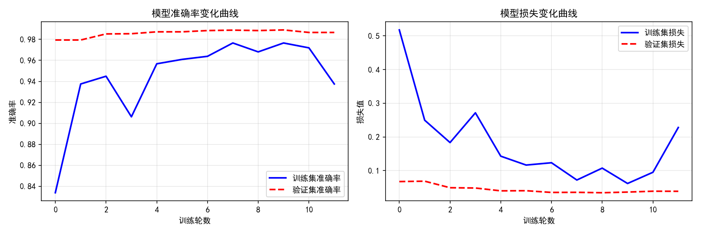
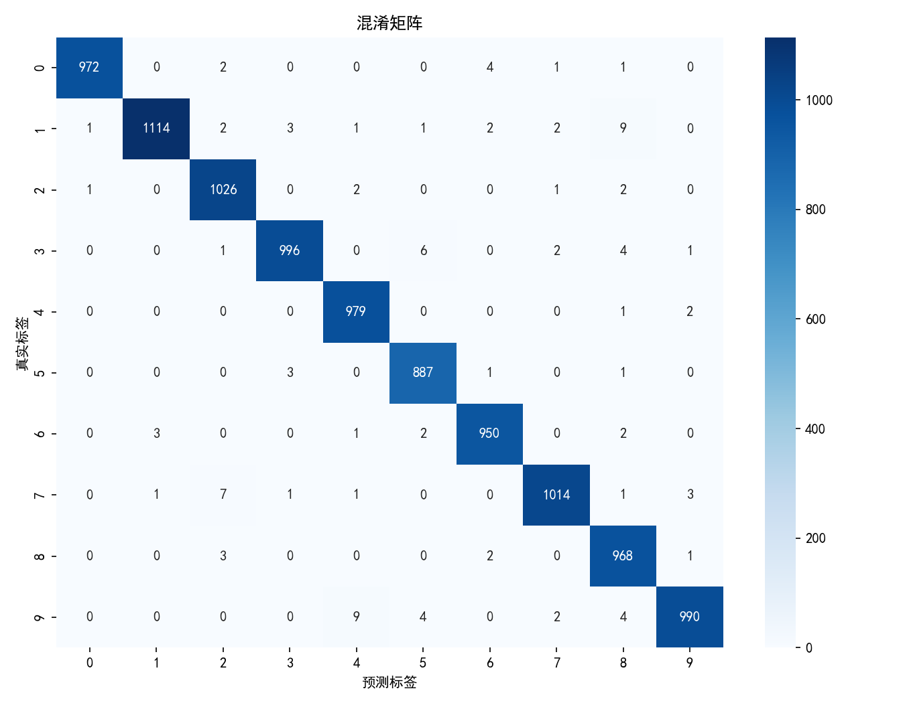

# 基于 CNN 的手写数字识别系统

> 用卷积神经网络（CNN）识别手写数字，基于 MNIST 数据集，测试集准确率 **99.3%**。

《人工智能》课程设计项目 · 作者：熊虎（重庆工商大学派斯学院 · 软件工程）

---

## 功能特性

- **完整训练流程**：数据加载 → 归一化 → CNN 建模 → 训练（含早停与最优权重保存）→ 测试评估
- **模型结构**：卷积层 ×2 + 池化层 ×2 + Dropout + 全连接层，有效抑制过拟合
- **可视化输出**：训练/验证准确率与损失曲线、混淆矩阵、预测样例、预测错误样例
- **逐类评估**：输出 0–9 每个数字的单独识别准确率
- **图形界面**：可选 `--gui` 参数启动手写输入界面，实时返回识别结果

## 技术栈

| 层次 | 技术 |
|------|------|
| 语言 | Python 3.10+ |
| 深度学习 | TensorFlow 2.x / Keras |
| 数据处理 | NumPy |
| 可视化 | Matplotlib、Seaborn、Scikit-learn |

## 快速开始

```bash
# 1. 安装依赖
pip install -r requirements.txt

# 2. 运行训练与评估（首次运行会自动下载 MNIST 数据集）
python cnn_mnist.py

# 3. 带手写输入界面运行
python cnn_mnist.py --gui
```

运行结束后会在当前目录生成：

```
best_cnn_model.h5          # 验证集最优模型权重
training_history.png       # 训练过程曲线
confusion_matrix.png       # 混淆矩阵
prediction_samples.png     # 预测样例
misclassified_samples.png  # 预测错误的样例
test_results.txt           # 测试结果汇总
```

## 实验结果

```
Test accuracy: 0.9896 (98.96%)   ← 某次运行的 test_results.txt
Test loss: 0.0288
Digit 0: 0.9918    Digit 5: 0.9944
Digit 1: 0.9815    Digit 6: 0.9916
Digit 2: 0.9942    Digit 7: 0.9864
Digit 3: 0.9861    Digit 8: 0.9938
Digit 4: 0.9969    Digit 9: 0.9812
```

测评图表见 [`docs/`](docs/) 目录。

| 训练曲线 | 混淆矩阵 |
|---|---|
|  |  |

## 目录结构

```
.
├── cnn_mnist.py               # 主程序（数据、建模、训练、评估、可视化）
├── requirements.txt
├── test_results.txt           # 一次运行的测试结果输出
├── docs/                      # 训练曲线 / 混淆矩阵 / 预测样例图
└── LICENSE
```

## License

[MIT](LICENSE) © 2026 熊虎
